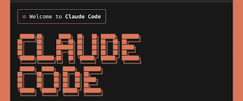
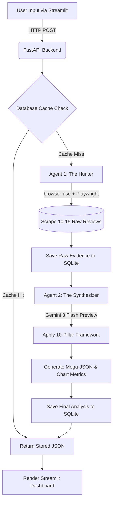

# 🧠 Universal Reviewer AI

**An Autonomous, Domain-Agnostic Decision Engine & Analytics Dashboard**

[Python 3.11+](https://www.python.org/downloads/)
[Streamlit](https://streamlit.io/)
[FastAPI](https://fastapi.tiangolo.com/)
[Google Gemini](https://deepmind.google/technologies/gemini/)
[Browser Use](https://github.com/browser-use/browser-use)

> **Universal Reviewer AI** goes beyond simple web scraping. It uses a dual-agent architecture to autonomously browse the internet, extract raw user sentiment, and synthesize the data against a rigorous **10-Pillar Universal Framework**. The result is a stunning, interactive analytics dashboard that helps users make data-driven decisions on *any* entity—be it a physical product, a piece of software, a book, or a concept.

---

## 🎥 Working Demo

[](frontend/assets/Claude_Code_Review.mp4)
[▶️ Click here to watch the full demo](frontend/assets/Claude_Code_Review.mp4)

---

## 🌟 Key Features

- **🕵️‍♂️ Dual-Agent ETL Pipeline:** Separates the extraction (The "Hunter" web scraper) from the transformation (The "Synthesizer" LLM) for enterprise-grade stability and speed.
- **🌐 Autonomous Web Browsing:** Powered by `browser-use` and Playwright, the agent navigates Reddit, Amazon, Trustpilot, and expert blogs entirely on its own.
- **📊 7-Chart Analytics Dashboard:** Dynamically generates Plotly visualizations including Radar Charts, Bubble Charts, Double Bar Graphs, Guage Charts, and Historical Trendlines.
- **🧠 10-Pillar Analytical Framework:** Evaluates entities based on universal metrics like *Purpose-Problem Fit*, *Cost vs. ROI*, *Reliability*, and *Consensus vs. Controversy*.
- **🗄️ Evidence-Backed Caching:** Stores all raw extracted user quotes in a local SQLite database, providing complete transparency and sub-second cache retrieval for repeated searches.
- **🎭 Persona-Based Decision Intelligence:** Uses rule-based logic to recommend whether you should "Buy / Skip" based on your specific user persona.

---

## 🏗️ System Architecture

This project utilizes a decoupled architecture, separating the heavy asynchronous AI workloads from the reactive frontend UI.




---

## 🛠️ Tech Stack

### Frontend

- **[Streamlit](https://streamlit.io/):** Reactive UI framework.
- **[Plotly](https://plotly.com/python/):** Interactive data visualization.
- **[Pandas](https://pandas.pydata.org/):** Data manipulation for chart rendering.

### Backend & AI

- **[FastAPI](https://fastapi.tiangolo.com/):** High-performance asynchronous API framework.
- **[Browser-Use](https://github.com/browser-use/browser-use):** Open-source library for autonomous browser control via Playwright.
- **[LangChain](https://www.langchain.com/):** LLM orchestration and prompting.
- **Google Gemini API:** Utilizing `gemini-3-flash-preview` for deep reasoning and complex JSON schema adherence.

### Database

- **[SQLAlchemy](https://www.sqlalchemy.org/):** ORM for database management.
- **SQLite:** Local relational database.
- **[uv](https://github.com/astral-sh/uv):** Ultra-fast Python package installer and resolver.

---

## 🚀 Getting Started (Local Development)

### Prerequisites

1. Python 3.11 or higher.
2. [uv](https://github.com/astral-sh/uv) package manager installed.
3. A Google Gemini API Key (Paid Tier recommended to avoid 429 Rate Limits).

### 1. Clone the Repository

```bash
git clone https://github.com/Aditya-DeskAI/product-review-analysis.git
cd product-review-analysis
```

### 2. Environment Setup

Install the dependencies and initialize the virtual environment using `uv`:

```bash
uv sync
```

Install the Playwright browser binaries required for the Hunter agent:

```bash
playwright install chromium
```

### 3. Configure API Keys

Create a `.env` file in the root directory:

```bash
touch .env
```

Add your Google Gemini API key to the `.env` file:

```env
GOOGLE_API_KEY=your_gemini_api_key_here
```

### 4. Run the Application

You must run the Backend and the Frontend in two separate terminal windows.

**Terminal 1 (Backend):**

```bash
uvicorn backend.main:app
```

**Terminal 2 (Frontend):**

```bash
streamlit run frontend/app.py
```

*The Streamlit dashboard will automatically open in your browser at `http://localhost:8501`.*

---

## 📂 Project Structure

```text
product-review-analysis/
│
├── frontend/                   # UI Presentation Layer
│   ├── app.py                  # Main Streamlit entry point
│   └── components/             # Modular UI components
│       ├── dashboard.py        # Plotly chart generation (7 charts)
│       ├── detailed_review.py  # 10-Pillar text breakdowns
│       ├── quick_review.py     # TL;DR and Decision Intelligence
│       └── evidence.py         # Raw sources and transparency
│
├── backend/                    # API and AI Logic Layer
│   ├── main.py                 # FastAPI application
│   ├── api/routes.py           # HTTP endpoints & Orchestration
│   ├── utils/data_parser.py    # Pydantic schema validation
│   ├── database/               # Memory Layer
│   │   ├── connection.py       # SQLAlchemy engine setup
│   │   └── models.py           # Relational schema (Raw Data & Final JSON)
│   └── agent/                  # AI Agents
│       ├── tasks.py            # Hunter & Synthesizer async execution
│       └── prompts.py          # System instructions & JSON formatting
│
├── product_cache.db            # SQLite Database (Auto-generated)
└── pyproject.toml              # Project metadata and dependencies
```
---

